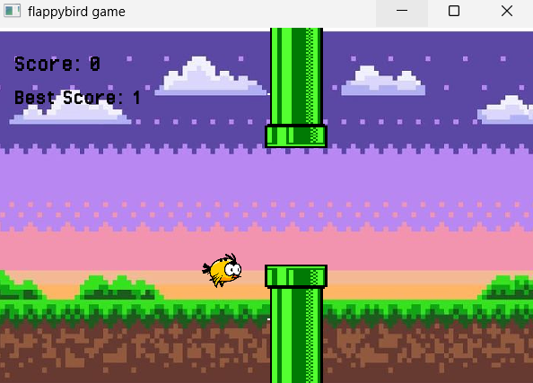

# Flappy Bird Clone

## Project Description

This project is a Flappy Bird clone game developed in C++ using the SFML library. The player controls a bird and tries to pass through randomly generated pipes without colliding with them. The game includes scoring, sound effects, sprite-based graphics, and a game over screen.

## Features

* Bird movement with gravity and jump mechanics
* Randomly generated pipe obstacles
* Collision detection
* Score system
* Best score tracking
* Start screen
* Game over screen
* Restart functionality
* Sound effects (flap, score, hit)
* Sprite-based graphics
* Pixel-style user interface

## Technologies Used

* C++
* SFML (Simple and Fast Multimedia Library)
* Makefile

## Project Structure

FlappyBird/
├─ assets/
│  ├─ fonts/
│  ├─ images/
│  └─ sounds/
├─ bin/
├─ include/
├─ lib/
├─ src/
├─ .gitignore
├─ Makefile
└─ README.md
```

## Controls

| Key   | Action                         |
| ----- | ------------------------------ |
| SPACE | Jump / Start Game              |
| R     | Restart Game (after Game Over) |

## How to Build

```bash
mingw32-make
```

## How to Run

```bash
mingw32-make run
```

## Screenshot



## Author

Leyla Konyalı
